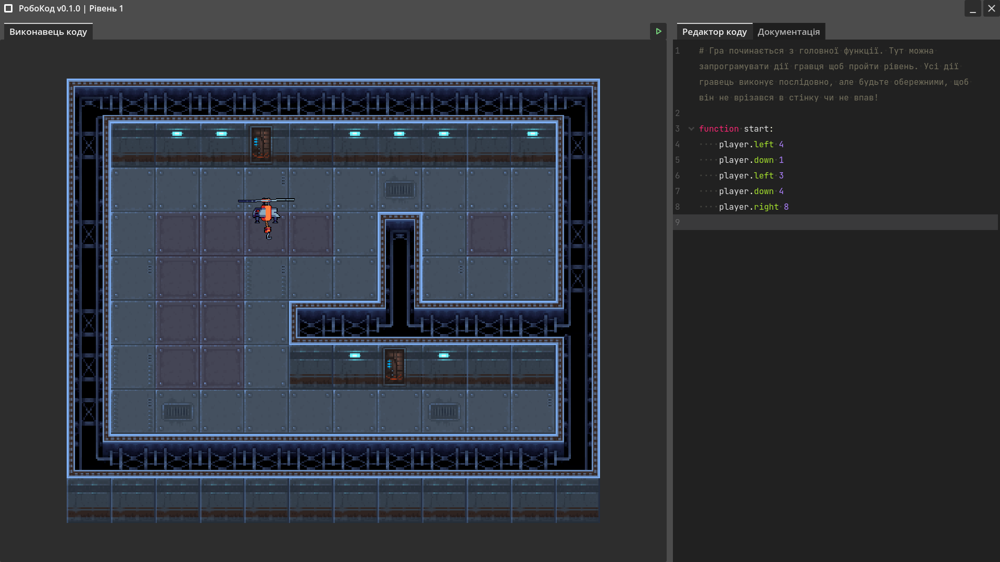

# РобоКод

Невелика освітня гра для ознайомлення з основами програмування. Виконуйте завдання та ведіть гравця до цілі за допомогою написання коду в ігровому середовищі кодування

## Запуск

Завантажте [останній випуск](releases/latest) для своєї платформи та запустіть

Системні вимоги для стабільної та комфортної гри

| Характеристики     | Мінімальні                                                  | Рекомендовані                                                 |
| ------------------ | ----------------------------------------------------------- | ------------------------------------------------------------- |
| Процесор           | Архітектура x32 Набір інструкцій SSE2                    | Архітектура x64 Набір інструкцій SSE4.2 4 фізичних ядра |
| Відеокарта         | Вбудована з підтримкою Vulkan 1.0                           | Дискретна з підтримкою Vulkan 1.2                             |
| Оперативна пам'ять | 2 ГіБ                                                       | 4 ГіБ                                                         |
| Сховище            | 150 МБ                                                      | 150 МБ                                                        |
| Операційна система | Windows 7/8/8.1 Дистрибутив Linux випущений пізніше 2016 | Windows 10 Дистрибутив Linux випущений пізніше 2020        |

---

## Інструменти

Ігровий двигун: [Godot](https://godotengine.org) 4.2.1

Плагіни

- [Godot Git Plugin](https://github.com/godotengine/godot-git-plugin) 3.1.0
- [Format on Save](https://github.com/ryan-haskell/gdformat-on-save) 1.2.0

Бібліотеки

- [Log.gd](https://github.com/russmatney/log.gd) 0.0.5

Інше

- [Krita](https://krita.org)

## Посилання

Використані пакети ресурсів

- [Google Material Symbols & Icons](https://fonts.google.com/icons)
- [Space station game asset](https://jonik9i.itch.io/free-space-station-game-asset)
- [Drones pack](https://craftpix.net/freebies/free-drones-pack-pixel-art)

Туторіали

- [Create Your First Godot 4 Game](https://quiver.dev/tutorials/create-your-first-godot-4-game)